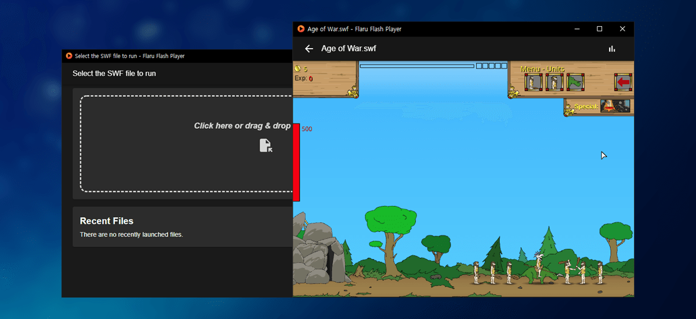
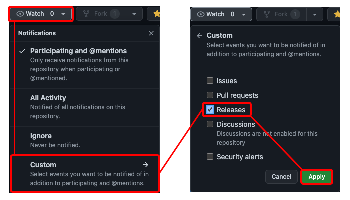

[](https://github.com/jooy2/flare/blob/main/LICENSE) [](https://github.com/jooy2/flaru/tags) [](https://github.com/jooy2/flaru/releases) [](https://github.com/jooy2)  



**Flare Player** is an unofficial emulator based on [Ruffle Flash Emulator](https://ruffle.rs). Created to provide a friendly interface and enhanced playing experience.

This application is simply implemented in JavaScript via Electron and is based on a self-hosted build of Ruffle, so performance may be somewhat lower than the official Ruffle desktop application.

For the official desktop app, please see the following link: https://github.com/ruffle-rs/ruffle/releases

> [!IMPORTANT]
>
> This application is an emulator and does not contain Flash game files (SWF).

## ⭐ Features

- ✅ It is a complete alternative to Adobe Flash Player. Run Flash Safely Anywhere
- ✅ Cross-platform: Windows, macOS, Linux supported!
- ✅ Multi-language and theme support
- ✅ Support for running split SWF files
- ✅ Drag-and-drop or one-click execution of SWF files from local PC
- ✅ Continue playing from the list of recently opened files.
- ✅ Customize various emulator settings.

## 💾 Downloads

- [Flare Downloads page](https://github.com/jooy2/flare/releases)

Since Flare does not sign the application, you may receive a security warning upon installation. You can safely ignore the security warning as this app does not use any permissions other than reading system file resources (e.g. loading SWF files).

Accordingly, version check and automatic update are currently not supported. We recommend upgrading by visiting the GitHub Releases page at regular intervals to check for new versions.

---

If you have a GitHub account, you can easily receive release notifications by email!



## 🔨 Build & Run

Before building or running, you need to install the module and add the Ruffle script file to the project.

First install the dependency module with the following command: ([Node.js](https://nodejs.org) pre-installed required)

```shell
$ npm i
```

The project sources do not include the `Ruffle` source files. So, before building or testing, you need to get the latest version of **Ruffle self-hosted distribution**.

Download the latest version of the self-hosted version from the [Ruffle Release Page](https://github.com/ruffle-rs/ruffle/releases), unzip it and paste it in the following path: `/src/renderer/public/js/ruffle`

You only need to paste the `.map`, `.js`, `.wasm` files inside the compressed file.

To test in the `development environment`, enter the following command:

```shell
$ npm i
$ npm run dev
```

And you can build on multiple platforms with the following command:

```shell
# Build current platform only
$ npm run build

# Cross-platform build
$ npm run build:all

# Build for Windows (.exe)
$ npm run build:win

# Build for macOS (.dmg)
$ npm run build:mac

# Build for Linux (.deb, .rpm)
$ npm run build:linux
```

### 🔧 Project Components

- [ViteJS](https://vitejs.dev)
- [TypeScript](https://typescriptlang.org)
- [Electron](https://electronjs.org)
- [React](https://reactjs.org)
- [Material-UI](https://mui.com)
- [Ruffle](https://ruffle.rs)

## 📋 License

Copyright © 2021-2025 [Jooy2](https://jooy2.com) <[jooy2.contact@gmail.com](mailto:jooy2.contact@gmail.com)> Released under the MIT license. (Source code excluding Ruffle and external modules)

> [!IMPORTANT]
>
> **Please do not distribute or release this project package externally without permission.**

For general use, download and use the package file on the GitHub releases page. You do not need to download the entire project.

For detailed license of Ruffle, please refer to the following document: [https://github.com/ruffle-rs/ruffle/blob/master/LICENSE.md](https://github.com/ruffle-rs/ruffle/blob/master/LICENSE.md)
